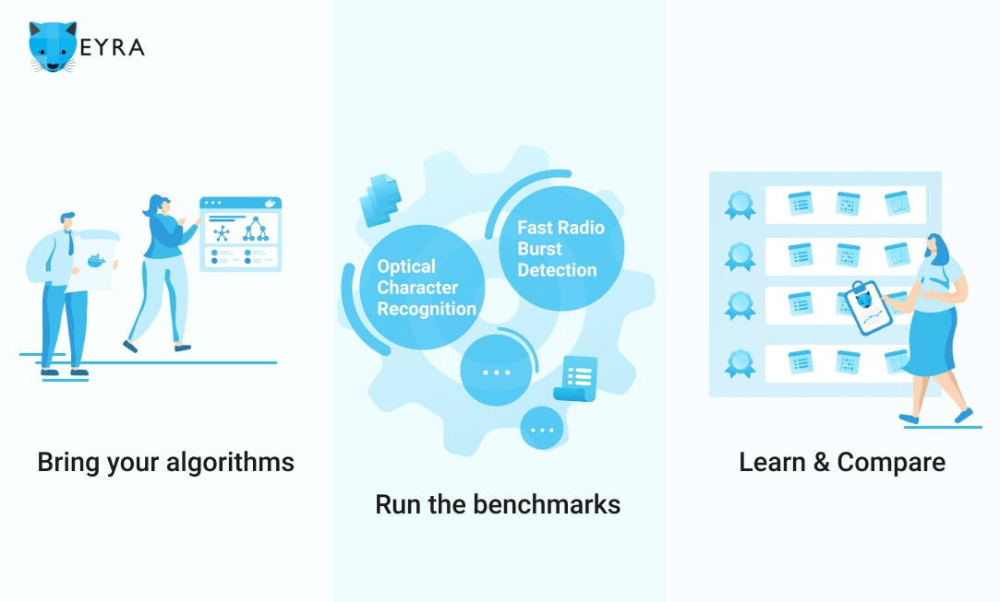

.. EYRA Tools documentation master file, created by
   sphinx-quickstart on Mon Jul 22 13:36:07 2019.
   You can adapt this file completely to your liking, but it should at least
   contain the root `toctree` directive.

EYRA Tools
==========

EYRA Tools is a Python package that helps you generate Docker containers
containing a submission or evaluation for the
`EYRA Benchmark Platform <https://www.eyrabenchmark.net>`_.

Benchmark participants should implement a submission
container, while benchmark organizers should implement an evaluation container.
The Docker containers can be generated by typing:

.. code-block:: sh

    eyra-generate [submission|evaluation] <container_name> [-d <docker hub account>]

Links
#####

* `EYRA Benchmark Platform <https://www.eyrabenchmark.net>`_
* `EYRA Tools on Github <https://github.com/EYRA-Benchmark/eyra-tools>`_
* `EYRA Tools documentation <https://eyra-tools.readthedocs.io/en/latest/>`_

.. warning::
    EYRA Tools and the documentation are works in progress. Not everything already works as advertised.
    If you are interested in organizing a Benchmark on the EYRA Benchmark Platform,
    please contact us via info@eyrabenchmark.net.

.. toctree::
   :maxdepth: 2
   :caption: Contents

   installation
   user_manual
   files
   scripts
   best_practices
   examples
   iris
   docs
