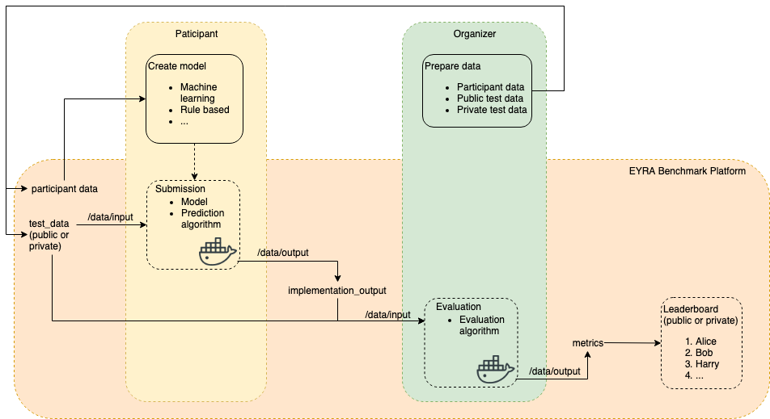
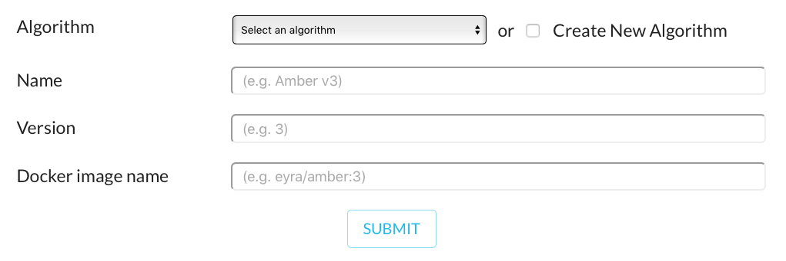
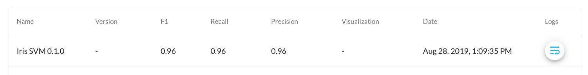

Demo benchmark: the Iris data
-----------------------------

This is a demo benchmark set up to show potential benchmark organizers what
needs to be done to set up a benchmark on the EYRA Benchmark Platform and to
allow potential benchmark participants to try submitting an algorithm.
All data and code used for this demo can be found `on github
<https://github.com/EYRA-Benchmark/eyra-iris-demo>`_.

   Overview of the EYRA Benchmark Platform.

The figure above shows how things work on the EYRA Benchmark Platform.
It shows the data sets involved (participant data, which can or cannot be ground truth
data, public test data, and optionally private test data).
The figure also shows which parts of the
benchmark are done by the platform and the parts that should be done
by benchmark organizers and participants.

Benchmark organizers have to prepare different data sets, and make (some of them)
make available (i.e., participant data and public test data). The EYRA Benchmark
Platform is used for distributing the data, but data preparation should be done
by the benchmark organizers themselves. To give a complete overview of what
organizing a benchmark entails, the demo also explains how the different data
sets were made.

Benchmark participants use the data provided by the benchmark organizers to
create a model.
As shown in the figure, model creation is the responsability of benchmark participants, and
is not done on the platform. Because we need a model to show how you can
submit to the Benchmark Platform, the demo specifies the model creation phase.
For the demo, a machine learning model is created, but it is possible
to create other types of models (WOULD BE NICE TO INSERT A REFERENCE HERE WITH EXAMPLES).
The demo model creation
code is in the ``model_creation`` directory. Usually, benchmarks have available
public test data that can be used to test the performance of the algorithm.

The demo benchmark uses the Iris dataset. The Iris dataset is a multivariate
dataset containing measurements of the petals and sepals of different types of
irises. The task is to predict the species of Iris (Setosa, Virginica, or
Versicolor) based on the length and width of petals and sepals. The data set
was randomly dived into three sets containing 50 samples each; one set is used
as participant data, one set as public test data and one set as private test
data. See under `For organizers: creating a benchmark`_ for more details about
the creation of the datasets.

For participants: create a model
################################

############
Get the data
############

Download the participant data and public test data from the `demo benchmark
<https://www.eyrabenchmark.net/benchmark/eebc5f91-be13-4433-9080-f920187b1982>`_.

- Go to the `benchmark page <https://www.eyrabenchmark.net/benchmark/eebc5f91-be13-4433-9080-f920187b1982>`_.
- Click Data.
- Read the data description.
- Download the files.

##############
Create a model
##############

For the demo, we are keeping things simple and
train Support Vector Machines using scikit-learn. The code can be found in
``model_creation/train.py`` and looks like:

.. literalinclude:: code/demo/train.py
  :language: python
  :linenos:

In line 1-8 we import the Python libraries we need. The model creation code consist
of two functions. Generally speaking, it is a good idea to divide your code
into multiple functions, e.g., one for data preprocessing, one for training,
and one for making predictions.
The function for training the model starts on line 11. It has as input
parameter the participant data file. The function reads the participant data
(line 16) and puts it into the format that is required by machine learning
algorithms in scikit-learn (lines 18-20).
Next, a Support Vector classifier is trained (lines 23-24) and returned (line 26).

The ``save_model()`` function on line 29 takes as input a classifier and path
and then saves the model to that path, so it can be saved in the submission
docker container and used for predicting iris labels.

The ``predict()`` function on line 33 can be used to test whether predicting
labels given a test file works as expected. It has two input parameters, a
trained classifier and the path to a test data file. The function reads the
test data (line 34) and returns the predictions (line 36).

.. note::
  When creating a model, feel free to use more functions and
  Python files if needed. For complicated code and if you want to be able to
  re-use for example data preprocessing functions, it might be a good idea to
  create your own Python package.

    .. todo::
        Add link to good tutorial about creating installable packages.

During implementation, you can test your model by running ``python train.py``
in the ``model_creation`` directory. Line 38 makes sure the code below runs
only if you type that command. First we do some administrative work to determine
where the input data can be found and output should be written (lines 41-44).
Next, we train the classifier (line 46) and save the model to a file (line 47).

To test whether the model can be used for prediction, a variable containing the
path to a test data file is created (line 50). Next, the ``predict()`` function
is called and the result of that is printed to the screen.
The ouput produced by running the train script is:

.. code-block:: sh

  $ python model_creation/train.py
  ['Iris-versicolor' 'Iris-virginica' 'Iris-virginica' 'Iris-virginica'
    'Iris-setosa' 'Iris-virginica' 'Iris-virginica' 'Iris-setosa'
    'Iris-setosa' 'Iris-versicolor' 'Iris-versicolor' 'Iris-setosa'
    'Iris-versicolor' 'Iris-versicolor' 'Iris-virginica' 'Iris-versicolor'
    'Iris-versicolor' 'Iris-versicolor' 'Iris-setosa' 'Iris-virginica'
    'Iris-virginica' 'Iris-setosa' 'Iris-versicolor' 'Iris-versicolor'
    'Iris-setosa' 'Iris-versicolor' 'Iris-setosa' 'Iris-versicolor'
    'Iris-virginica' 'Iris-versicolor' 'Iris-virginica' 'Iris-virginica'
    'Iris-virginica' 'Iris-setosa' 'Iris-virginica' 'Iris-virginica'
    'Iris-setosa' 'Iris-virginica' 'Iris-setosa' 'Iris-virginica'
    'Iris-setosa' 'Iris-setosa' 'Iris-setosa' 'Iris-setosa' 'Iris-versicolor'
    'Iris-versicolor' 'Iris-virginica' 'Iris-versicolor' 'Iris-setosa'
    'Iris-setosa']

This result tells us that the prediction mechanics work, but it doesn't say
anything about performance. If you would like to estimate performance of your
model using participant data only, have a look at
`cross-validation <https://machinelearningmastery.com/k-fold-cross-validation/>`_.

For participants: create a submission
#####################################

Every benchmark on the EYRA Benchmark Platform has a leaderboard that shows the
performance of models according to the metric(s) proposed by the benchmark
organizers. To have the benchmark platform calculate these metrics for our model,
we need to create
a submission Docker container that contains a prediction algorithm.

#####################################
Prepare the Docker container and data
#####################################

A boilerplate submission container can be generated using the `EYRA Tools
<https://github.com/EYRA-Benchmark/eyra-tools>`_. Run ``eyra-generate
submission iris_svm`` (after :ref:`installing the EYRA Tools<installation:Installation>`),
cd into the directory that is generated (``iris_svm``),
and copy the data into the boilerplate container:

.. code-block:: sh

    eyra-generate submission iris_svm
    cd iris_svm
    cp ~/Downloads/iris_public_test_data.csv data/input/test_data
    mkdir src/model
    cp ~/code/eyra-iris-demo/model_creation/iris_svm_model src/model/iris_svm_model

Please note that the file paths from which files are copied need to be changed
to the correct paths on your computer.

.. todo::
    Resolve file naming issues (the submission container expects input
    files with specific names and should produce output files with specific
    names. These names are different from what the files are called now).

##################################
Implement the prediction algorithm
##################################

Implement the prediction algorithm in ``src/submission.py``.
For the iris SVM this file looks like:

.. literalinclude:: code/demo/submission.py
  :language: python
  :linenos:

The prediction algorithm has two functions, ``iris_svm_predict()`` (line 9)
and ``predict()`` (line 22), which is the same as the ``predict()`` function
we used during model creation. The ``iris_svm_predict()`` function first loads
a model from file (line 11). It then predicts class
labels given the model and the test data file (line 14). On line 17-19 a
pandas DataFrame containing a single column called 'class' is created and
written to a csv file.
Starting from line 28, we see how these functions are called to generate the
implementation output used to calculate performance. Line 32 defines a
variable containing the path to the model file. Lines 36 and 37 define variables
that contain the paths to the test data and output respectively. Finally, on
line 39, the ``iris_svm_predict()`` function is called using the paths as
arguments.

You can test the prediction algorithm by running ``python src/submission.py``
from the ``iris_svm`` directory. If everything works as
expected, we can start with preparing the Docker container.

########################
Specify the dependencies
########################

Add all Python libraries needed to run the prediction algorithm to ``requirements.txt``.
For the demo we add ``pandas`` and ``scikit-learn``.

######################################################
Make sure the code can run inside the Docker container
######################################################

Update ``src/run_submission.py``, so it calls the ``iris_svm_predict()`` function:

.. literalinclude:: code/demo/run_submission.py
  :language: python
  :linenos:

Because the code for the prediction algorithm is already done, we only need to
make a few changes to the boilerplate code. Lines 1-4 contain the imports.
On line 4 we import the ``iris_svm_predict()`` function from
``src/submission.py``. On line 5, a class ``Submission`` is defined
that has a single method ``run()``. On the EYRA Benchmark Platform, this function
is executed, with specific input arguments for ``test_file`` and ``out_file``,
as specified in lines 16-21. Lines 16-21 should not be changed. It specifies
the paths to which the input (``test_file`` on line 18) and the output
(``out_file`` on line 19) are mapped inside the Docker container. On line
21, a ``Submission`` object is created and its ``run()`` method is called
with the correct arguments. To make it work with our particular prediction
algorithm, we need to update the ``run()`` method. On line 9, we specify the
path to the model file. We copied this file into the ``src/model`` directory in
a previous step. Everything that is inside the
``src`` directory is copied to the Docker container. So that is
where you can put data and code required by the prediction algorithm.
On line 12, we call ``iris_svm_predict()`` as before.

#########################
Test the Docker container
#########################

To build the Docker container and run the algorithm inside it, type
``./test.sh``. You get the following output:

.. code-block:: sh

    $ ./test.sh
    Sending build context to Docker daemon   38.4kB
    Step 1/7 : FROM python:3.7-slim
    3.7-slim: Pulling from library/python
    1ab2bdfe9778: Pull complete
    b5d689d9c40c: Pull complete
    5b13ee99f0ea: Pull complete
    d617973d7fa5: Pull complete
    abfef9fe6f0b: Pull complete
    Digest: sha256:5f83c6d40f9e9696d965785991e9b85e4baef189c7ad1078483d15a8657d6cc0
    Status: Downloaded newer image for python:3.7-slim
    ---> f96c28b7013f
    Step 2/7 : RUN mkdir -p /opt/src /input /output
    ---> Running in 0e4ae1aa1317
    Removing intermediate container 0e4ae1aa1317
    ---> 20dd0c44733e
    Step 3/7 : WORKDIR /opt/src
    ---> Running in ff5c0b8dbbb3
    Removing intermediate container ff5c0b8dbbb3
    ---> ea18e90edb31
    Step 4/7 : COPY requirements.txt /opt/src/
    ---> 7e097b17cd59
    Step 5/7 : RUN python -m pip install -r requirements.txt
    ---> Running in 700020ca752d
    Collecting pandas (from -r requirements.txt (line 1))
      Downloading https://files.pythonhosted.org/packages/7e/ab/ea76361f9d3e732e114adcd801d2820d5319c23d0ac5482fa3b412db217e/pandas-0.25.1-cp37-cp37m-manylinux1_x86_64.whl (10.4MB)
    Collecting scikit-learn (from -r requirements.txt (line 2))
      Downloading https://files.pythonhosted.org/packages/9f/c5/e5267eb84994e9a92a2c6a6ee768514f255d036f3c8378acfa694e9f2c99/scikit_learn-0.21.3-cp37-cp37m-manylinux1_x86_64.whl (6.7MB)
    Collecting numpy>=1.13.3 (from pandas->-r requirements.txt (line 1))
      Downloading https://files.pythonhosted.org/packages/25/eb/4ecf6b13897391cb07a4231e9d9c671b55dfbbf6f4a514a1a0c594f2d8d9/numpy-1.17.1-cp37-cp37m-manylinux1_x86_64.whl (20.3MB)
    Collecting python-dateutil>=2.6.1 (from pandas->-r requirements.txt (line 1))
      Downloading https://files.pythonhosted.org/packages/41/17/c62faccbfbd163c7f57f3844689e3a78bae1f403648a6afb1d0866d87fbb/python_dateutil-2.8.0-py2.py3-none-any.whl (226kB)
    Collecting pytz>=2017.2 (from pandas->-r requirements.txt (line 1))
      Downloading https://files.pythonhosted.org/packages/87/76/46d697698a143e05f77bec5a526bf4e56a0be61d63425b68f4ba553b51f2/pytz-2019.2-py2.py3-none-any.whl (508kB)
    Collecting scipy>=0.17.0 (from scikit-learn->-r requirements.txt (line 2))
      Downloading https://files.pythonhosted.org/packages/94/7f/b535ec711cbcc3246abea4385d17e1b325d4c3404dd86f15fc4f3dba1dbb/scipy-1.3.1-cp37-cp37m-manylinux1_x86_64.whl (25.2MB)
    Collecting joblib>=0.11 (from scikit-learn->-r requirements.txt (line 2))
      Downloading https://files.pythonhosted.org/packages/cd/c1/50a758e8247561e58cb87305b1e90b171b8c767b15b12a1734001f41d356/joblib-0.13.2-py2.py3-none-any.whl (278kB)
    Collecting six>=1.5 (from python-dateutil>=2.6.1->pandas->-r requirements.txt (line 1))
      Downloading https://files.pythonhosted.org/packages/73/fb/00a976f728d0d1fecfe898238ce23f502a721c0ac0ecfedb80e0d88c64e9/six-1.12.0-py2.py3-none-any.whl
    Installing collected packages: numpy, six, python-dateutil, pytz, pandas, scipy, joblib, scikit-learn
    Successfully installed joblib-0.13.2 numpy-1.17.1 pandas-0.25.1 python-dateutil-2.8.0 pytz-2019.2 scikit-learn-0.21.3 scipy-1.3.1 six-1.12.0
    Removing intermediate container 700020ca752d
    ---> 624723a5788f
    Step 6/7 : ADD src /opt/src/
    ---> a46bb5006326
    Step 7/7 : ENTRYPOINT "python" "-m" "run_submission"
    ---> Running in 12b22dbb283f
    Removing intermediate container 12b22dbb283f
    ---> e119001e4684
    Successfully built e119001e4684
    Successfully tagged iris_svm:latest

################################
Push the container to Docker Hub
################################

If everything works as expected, you can push your container to Docker Hub:

.. code-block:: sh

    ./push.sh [version]

The ouput looks like:

.. code-block:: sh

    $ ./push.sh 0.1.0
    Sending build context to Docker daemon   38.4kB
    Step 1/7 : FROM python:3.7-slim
    ---> f96c28b7013f
    Step 2/7 : RUN mkdir -p /opt/src /input /output
    ---> Using cache
    ---> 20dd0c44733e
    Step 3/7 : WORKDIR /opt/src
    ---> Using cache
    ---> ea18e90edb31
    Step 4/7 : COPY requirements.txt /opt/src/
    ---> Using cache
    ---> 7e097b17cd59
    Step 5/7 : RUN python -m pip install -r requirements.txt
    ---> Using cache
    ---> 624723a5788f
    Step 6/7 : ADD src /opt/src/
    ---> Using cache
    ---> a46bb5006326
    Step 7/7 : ENTRYPOINT "python" "-m" "run_submission"
    ---> Using cache
    ---> e119001e4684
    Successfully built e119001e4684
    Successfully tagged iris_svm:latest
    Using tag: 0.1.0.
    The push refers to repository [docker.io/eyra/iris_svm]
    94c7819de05e: Pushed
    3e64f1dd2a39: Pushed
    764a69f7b78b: Pushed
    56edc5355daa: Pushed
    1808163506f4: Mounted from library/python
    acd5d8dd0a11: Layer already exists
    e18984c86e86: Layer already exists
    523a99e3c88d: Layer already exists
    1c95c77433e8: Layer already exists
    0.1.0: digest: sha256:6f128fa8e62abecd98a36cea12a69071f4569b6cea031b84649f273afaa01fd3 size: 2205

.. tip::
    You need to login to Docker Hub (``docker login``) before you can push the container.

.. tip::
    If you want to use the ``push.sh`` script in the `EYRA Iris Demo github
    repository <https://github.com/EYRA-Benchmark/eyra-iris-demo>`_,
    you need to replace ``eyra`` with your own Docker Hub account.

############################################
Submit the Docker container to the benchmark
############################################

On the EYRA Benchmark Platform, log in and go to the `EYRA Iris Demo page
<https://www.eyrabenchmark.net/benchmark/eebc5f91-be13-4433-9080-f920187b1982>`_
and click 'create submission'. Now you see a form:

First you need to specify the algorithm you are submitting. If your algorithm
isn't in the dropdown list, you can create a new one by checking the 'Create New
Algorithm' box. The algorithm name should refer to the model you created. For
this demo we choose 'Iris SVM'. Under 'Name' we put 'Iris SVM 0.1.0', 'Version'
is '0.1.0', and as 'Docker image name' we write ``eyra/iris_svm:0.1.0``.

After clicking 'Submit' a job that will run the submission is created. This can
take a little while. The submission is added to the 'Results' tab of the benchmark
page. If the submission job is finished, you can see the performance of the
algorithm:

For organizers: create a benchmark
##################################

To set up a benchmark on the EYRA Benchmark Platform you should
`contact the EYRA Benchmark team <mailto:info@eyrabenchmark.net>`_, and we will
get back to you with more specific instructions. In addition to thorough and
consise descriptions of the task, the data, the ground truth, and the evaluation
metrics (`see the benchmarks on the platform for examples
<https://www.eyrabenchmark.net/benchmarks>`_), organizers need to provide:

* Participant data
* Public test data + public test ground truth: this is the data used for creating
  the public leaderboard.
* Private test data + private test ground truth: this is hold-out data, that is
  used for creating the private leaderboard.
* A Docker container containing the evaluation algorithm. Have a look at
  :ref:`the tutorial<iris:For organizers: creating an evaluation>` to see how this is done.

.. note::
  For demonstration purposes, the demo benchmark's data is available on
  `github <https://github.com/EYRA-Benchmark/eyra-iris-demo>`_.
  For a real benchmark, the public test ground truth, and the private test data
  and ground truth should not be shared with participants. This helps to
  `make sure participants' submissions focus on understanding the problem and
  advancing science rather than incrementally improving metrics <https://arxiv.org/abs/1811.03014>`_.

A `notebook
<https://github.com/EYRA-Benchmark/eyra-iris-demo/blob/master/create-datasets.ipynb>`_
specifying how the demo datasets were created is avaiable in the `demo benchmark
repository on github <https://github.com/EYRA-Benchmark/eyra-iris-demo>`_.

For organizers: create an evaluation
####################################

Benchmark organizers must submit a Docker container that compares the output of
a submission to gold standard data and calculates performance.

#####################################
Prepare the Docker container and data
#####################################

We start with generating a boilerplate evaluation Docker container by running:

.. code-block:: sh

    eyra-generate evaluation iris_eval -d <docker hub account>

Next, we copy data to the ``data/input`` directory:

.. code-block:: sh

    cd iris_eval
    cp ~/code/eyra-iris-demo/iris_public_test_gt.csv data/input/ground_truth
    cp ~/code/eyra-iris-demo/iris_public_test_gt.csv data/input/implementation_output

.. note::
    For convenience we are using the public test ground truth as implementation
    output. For real benchmarks it might be a good idea to (manually) create an
    implementation output file that is not the same as the ground truth.

Please note that the file paths from which files are copied need to be changed
to the correct paths on your computer.

.. todo::
    Resolve file naming issues (the submission container expects input
    files with specific names and should produce output files with specific
    names. These names are different from what the files are called now).

##################################
Implement the evaluation algorithm
##################################

Implement the evaluation algorithm in ``src/valuation.py``.
For the demo benchmark this file looks like:

.. literalinclude:: code/demo/evaluation.py
  :language: python
  :linenos:

As usual, we first import the required Python libraries (line 1-6). On line 9
the main evaluation function (``evaluate_iris()``) is defined. Inside this function,
the ground truth data is read (line 10) and converted to a list of class labels
(line 11). Next, the same is done for the implementation output (lines 13 and 14).
For this evaluation, we calculate precision, recall and F1-measure using ``sklearn``
(lines 16-18). The metrics are put inside the data structure required by EYRA
Benchmark leaderboards:

.. code-block:: sh

    {
      'metrics': {
          'Precision': 1.0,
          'Recall': 1.0,
          'F1': 1.0
      }
    }

And written to a json file (lines 23 and 24).

When the ``src/evaluation.py`` script is run, we define paths to the input and
output data (lines 33-35). Finally, the ``evaluate_iris()`` function is called.

You can check that everything works as expected by inspecting the output file:

.. code-block:: sh

    $ cat data/output
    {"metrics": {"Precision": 1.0, "Recall": 1.0, "F1": 1.0}}

########################
Specify the dependencies
########################

Add all Python libraries needed to run the evaluation algorithm to ``requirements.txt``.
For the demo we add ``pandas`` and ``scikit-learn``.

#########################################################
Make sure the evaluation runs inside the Docker container
#########################################################

To actually evaluate performance of submissions, we need to run the evaluation
code inside a Docker container. In order to be able to do this, we change
``src/run_evaluation.py`` to:

.. literalinclude:: code/demo/run_evaluation.py
  :language: python
  :linenos:

The only lines we have to change in the boilerplate code are line 3 and line 12.
On line 3 we import the ``evaluate_iris()`` function from ``src/evaluation.py``.
And on line 12, we call this function with the predefined arguments.

.. note::
   For a real benchmark it is a good idea to replace the boilerplate
   documentation on lines 8-11 with something that helps users understand what
   is going on.

#########################
Test the Docker container
#########################

To build the Docker container and run the algorithm inside it, type
``./test.sh``. You get the following output:

.. code-block:: sh

    $ ./test.sh
    Sending build context to Docker daemon  37.38kB
    Step 1/7 : FROM python:3.7-slim
    3.7-slim: Pulling from library/python
    1ab2bdfe9778: Pull complete
    b5d689d9c40c: Pull complete
    5b13ee99f0ea: Pull complete
    d617973d7fa5: Pull complete
    abfef9fe6f0b: Pull complete
    Digest: sha256:5f83c6d40f9e9696d965785991e9b85e4baef189c7ad1078483d15a8657d6cc0
    Status: Downloaded newer image for python:3.7-slim
    ---> f96c28b7013f
    Step 2/7 : RUN mkdir -p /opt/src /input /output
    ---> Running in 162d645f6ab4
    Removing intermediate container 162d645f6ab4
    ---> 6bfe8fb274ca
    Step 3/7 : WORKDIR /opt/src
    ---> Running in 728e00c886c8
    Removing intermediate container 728e00c886c8
    ---> 8e0b820ab7b7
    Step 4/7 : COPY requirements.txt /opt/src/
    ---> 86c6dd868d39
    Step 5/7 : RUN python -m pip install -r requirements.txt
    ---> Running in 5b6aa5bc84c6
    Collecting pandas (from -r requirements.txt (line 1))
      Downloading https://files.pythonhosted.org/packages/7e/ab/ea76361f9d3e732e114adcd801d2820d5319c23d0ac5482fa3b412db217e/pandas-0.25.1-cp37-cp37m-manylinux1_x86_64.whl (10.4MB)
    Collecting scikit-learn (from -r requirements.txt (line 2))
      Downloading https://files.pythonhosted.org/packages/9f/c5/e5267eb84994e9a92a2c6a6ee768514f255d036f3c8378acfa694e9f2c99/scikit_learn-0.21.3-cp37-cp37m-manylinux1_x86_64.whl (6.7MB)
    Collecting python-dateutil>=2.6.1 (from pandas->-r requirements.txt (line 1))
      Downloading https://files.pythonhosted.org/packages/41/17/c62faccbfbd163c7f57f3844689e3a78bae1f403648a6afb1d0866d87fbb/python_dateutil-2.8.0-py2.py3-none-any.whl (226kB)
    Collecting numpy>=1.13.3 (from pandas->-r requirements.txt (line 1))
      Downloading https://files.pythonhosted.org/packages/25/eb/4ecf6b13897391cb07a4231e9d9c671b55dfbbf6f4a514a1a0c594f2d8d9/numpy-1.17.1-cp37-cp37m-manylinux1_x86_64.whl (20.3MB)
    Collecting pytz>=2017.2 (from pandas->-r requirements.txt (line 1))
      Downloading https://files.pythonhosted.org/packages/87/76/46d697698a143e05f77bec5a526bf4e56a0be61d63425b68f4ba553b51f2/pytz-2019.2-py2.py3-none-any.whl (508kB)
    Collecting joblib>=0.11 (from scikit-learn->-r requirements.txt (line 2))
      Downloading https://files.pythonhosted.org/packages/cd/c1/50a758e8247561e58cb87305b1e90b171b8c767b15b12a1734001f41d356/joblib-0.13.2-py2.py3-none-any.whl (278kB)
    Collecting scipy>=0.17.0 (from scikit-learn->-r requirements.txt (line 2))
      Downloading https://files.pythonhosted.org/packages/94/7f/b535ec711cbcc3246abea4385d17e1b325d4c3404dd86f15fc4f3dba1dbb/scipy-1.3.1-cp37-cp37m-manylinux1_x86_64.whl (25.2MB)
    Collecting six>=1.5 (from python-dateutil>=2.6.1->pandas->-r requirements.txt (line 1))
      Downloading https://files.pythonhosted.org/packages/73/fb/00a976f728d0d1fecfe898238ce23f502a721c0ac0ecfedb80e0d88c64e9/six-1.12.0-py2.py3-none-any.whl
    Installing collected packages: six, python-dateutil, numpy, pytz, pandas, joblib, scipy, scikit-learn
    Successfully installed joblib-0.13.2 numpy-1.17.1 pandas-0.25.1 python-dateutil-2.8.0 pytz-2019.2 scikit-learn-0.21.3 scipy-1.3.1 six-1.12.0
    Removing intermediate container 5b6aa5bc84c6
    ---> 99373d908df0
    Step 6/7 : ADD src /opt/src/
    ---> d842ba9ce114
    Step 7/7 : ENTRYPOINT "python" "-m" "run_evaluation"
    ---> Running in 54d46f982d81
    Removing intermediate container 54d46f982d81
    ---> 4e928f9dc2fd
    Successfully built 4e928f9dc2fd
    Successfully tagged iris_eval:latest

################################
Push the container to Docker Hub
################################

If everything works as expected, you can push your container to Docker Hub:

.. code-block:: sh

    ./push.sh [version]

The ouput looks like:

.. code-block:: sh

    $ ./push.sh 0.1.0
    Sending build context to Docker daemon  37.38kB
    Step 1/7 : FROM python:3.7-slim
    ---> f96c28b7013f
    Step 2/7 : RUN mkdir -p /opt/src /input /output
    ---> Using cache
    ---> 6bfe8fb274ca
    Step 3/7 : WORKDIR /opt/src
    ---> Using cache
    ---> 8e0b820ab7b7
    Step 4/7 : COPY requirements.txt /opt/src/
    ---> Using cache
    ---> 86c6dd868d39
    Step 5/7 : RUN python -m pip install -r requirements.txt
    ---> Using cache
    ---> 99373d908df0
    Step 6/7 : ADD src /opt/src/
    ---> Using cache
    ---> d842ba9ce114
    Step 7/7 : ENTRYPOINT "python" "-m" "run_evaluation"
    ---> Using cache
    ---> 4e928f9dc2fd
    Successfully built 4e928f9dc2fd
    Successfully tagged iris_eval:latest
    Using tag: 0.1.0.
    The push refers to repository [docker.io/eyra/iris_eval]
    2a0fb79103de: Pushed
    f25642385f8b: Pushed
    27f89623cc9c: Pushed
    21bb16c9b065: Pushed
    1808163506f4: Mounted from eyra/iris_svm
    acd5d8dd0a11: Mounted from eyra/iris_svm
    e18984c86e86: Mounted from eyra/iris_svm
    523a99e3c88d: Mounted from eyra/iris_svm
    1c95c77433e8: Mounted from eyra/iris_svm
    0.1.0: digest: sha256:492fbb2791b0613817150521b2e2597e6ca02ac07d0157f5f253765568f63a91 size: 2204

.. tip::
    You need to login to Docker Hub (``docker login``) before you can push the container.

.. tip::
    If you want to use the ``push.sh`` script in the `EYRA Iris Demo github
    repository <https://github.com/EYRA-Benchmark/eyra-iris-demo>`_,
    you need to replace ``eyra`` with your own Docker Hub account.

######################################
Set the benchmark evaluation container
######################################

Set the benchmark's evaluation container to ``eyra/iris_eval:0.1.0``.

.. todo::
    There is no form yet for benchmark organizers. The tutorial should be updated
    once it is clear how benchmark organizers should specify their evaluation
    container.

